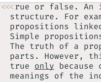

# Inbox

## Bugs

- [ ] seems like img-clip does not work

### Style

- [ ] add autocompletion for paths in markdown
- [ ] remove annoying line on explorer
- [ ] make `code` styled better, with rounding, padding and border
- [ ] add new checkpoint to denote dropped tasks
- [ ] extend coloring of headers in markdown-renderer
- [ ] add coloring to checkboxes in markdown-renderer
- [ ] remove padding from the right side of explorer

#### Plugins

- [ ] in blink, how to gd 
- [ ] mini.pairs old version overwrites user CR, need to update it somehow
- [ ] add [vimwiki](https://github.com/vimwiki/vimwiki)
- [ ] add
  [mkdnflow](https://github.com/jakewvincent/mkdnflow.nvim?tab=readme-ov-file)
- [ ] compare mkdnflow and
  [markdown-oxide](https://github.com/Feel-ix-343/markdown-oxide)
- [ ] find some app that can edit png with transparend bg
- [x] implement that image height parameter myself for snacks.image

##### Keymaps

- [ ] add keybinds to work with checklists better
- [ ] when go to defenition, center screen
- [ ] right now when i try to paste text with `<leader>p` it tries to paste image. I need a different shortcut for pasting images.
- [ ] 

annoying thing at the top left corner when scrolling documents with smooth scroll.

###### Meta

- [ ] add info about how i solved annoying padding
- [ ] add info about how i solved small icons
- [ ] automatically archive checkboxed entries

# Archive

- [ ] use numbered lists or something else instead of headers
- [x] (bugs) some funky stuff with origin in git
- [x] (font) make glyphs fork ->
- [x] (keymaps) added smoothscroll, now scrolling with smoothwrap wont sent me to the moon
- [x] (plugins) markdownrenderer, now quotes work just ok with softwrap mode. https://github.com/MeanderingProgrammer/render-markdown.nvim/issues/419#issuecomment-2855431212
- [x] (plugins) when pressing enter on - make new - on next line
- [x] (plugins) added mdx support for markdown-renderer
- [x] (style) down show dotted spacebars for markdown
- [x] (style) added word count to lualine, added filename and removed unix
- [x] (style) make better line wrapping, hardline should be always active, look
  up if there is a way to hardcode it
- [x] (style) filtering out and not showing notification messages on file save
  lol hahaha
- [x] (style) made latex / math white
- [x] (plugins) add img-clip
- [x] (style) enabled catppuccin for notification
- [x] (style) add format on save
- [x] (style) add 80 width limit to markdown
- [-] (keymaps) add keybind to exit nvim on `ctrl+e`
- [x] (keymaps) add keybind to save on `ctrl+s`
- [x] (bugs) fix markdown error on save
- [x] (meta) split notes in nvim into todo/plugins/fixes

